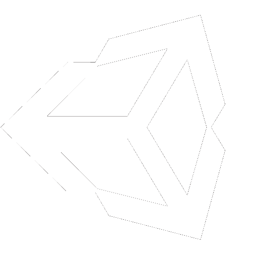
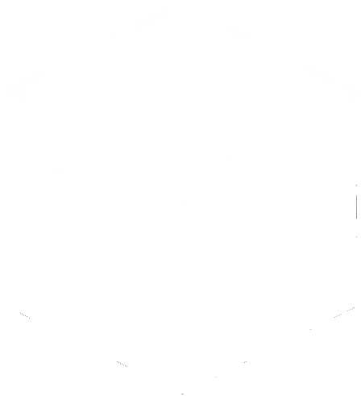

## Hey There 👋
### Im gjoe, a professional developer

Okay, well maybe Im not *that* professional, but I think I make some pretty cool stuff

## What I do 
<html>

<!-- Credit for Minecraft logo here: https://github.com/simple-icons/simple-icons/issues/531 -->

<link rel="stylesheet" href="/stylesheets/index.css"/>